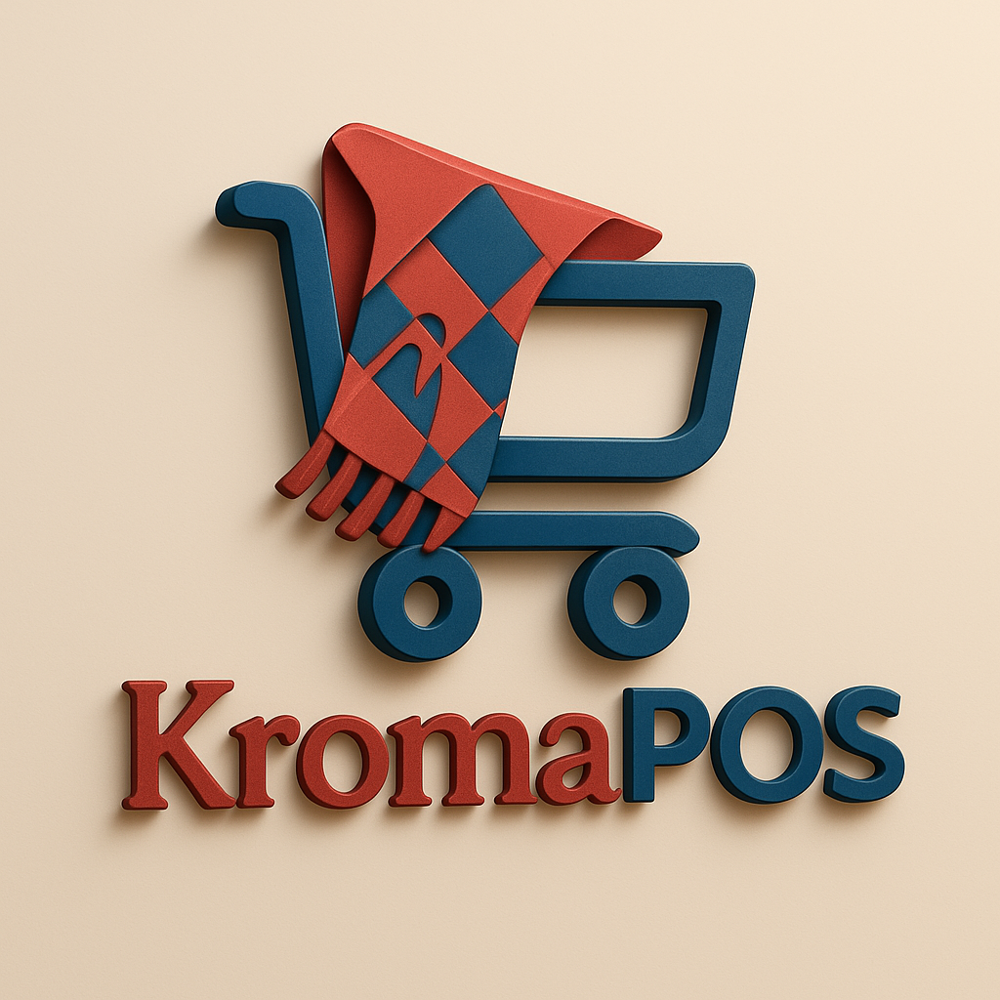

<h1 align="center">
  
  <h1>KromaPOS</h1>
  <p>Empowering Local Commerce — Anywhere, Anytime.</p>
</h1>


**KromaPOS** is an open-source, offline-first Point of Sale (POS) system built with **React** and **Electron**, designed to empower small and medium-sized businesses in Cambodia and beyond. With a sleek interface, modern tech stack, and local-first mindset, KromaPOS makes selling easy—whether you're online or completely offline.

---

## 🌟 Features

- ⚡ **Offline-first** – Operates smoothly without an internet connection
- 🛍️ **Sales & Inventory Management**
- 🧾 **Receipt Printing Support**
- 🧑‍💼 **Multi-user Login & Role-based Access**
- 📦 **Product and Category Management**
- 📊 **Sales Reporting Dashboard**
- 🌐 **Multi-language Support (Coming Soon)**
- 🔄 **Sync to Cloud (Optional Future Feature)**

---

## 📦 Tech Stack

- **Frontend**: React, Tailwind CSS
- **Desktop Shell**: Electron
- **Database (Offline)**: SQLite
- **Data Sync (Planned)**: FastAPI or Firebase
- **State Management**: Zustand or Redux Toolkit

---

## 🛠️ Installation

### Prerequisites

- Node.js (v18+)
- Git

### Clone and Install

```bash
git clone https://github.com/yourusername/kromapos.git
cd kromapos
npm install
